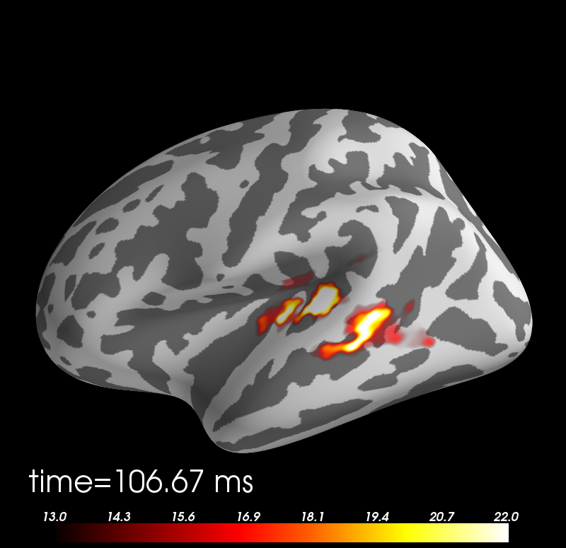

.. raw:: html

   
   MNE-Python: MNE with Python
   
    Alexandre Gramfort, Martin Luessi, Matti S. Hamalainen
   

Aalto University, June 19, 2012

----

Outline:
--------

- Why use Python for MEG?
- Design Principles
- Status
- Feature overview
- Example Usage
- Future Plans

----

.. Why use Python for MEG?
.. -----------------------------------
.. 
.. - Python is free (as in speech)
.. - It "combines remarkable power with very clear syntax" [1]_
.. - Well suited for high performance numerical computing (NumPy, SciPy, ...)
.. - High quality 2D and 3D visualizations (pylab, mlab, ...)
.. - Increasingly popular in neuroscience (nipy, nipype, nitime, ...)
.. 
.. 
.. .. [1] `<http://docs.python.org/faq/general.html#what-is-python/>`_
.. 
.. ----

MNE-Python Design Principles
----------------------------

- Provide a powerful but easy-to-use scripting interface (no GUI)
- Extend functionality of the MNE command line tools
- Implement all features of the MNE Matlab toolbox
- Simplicity, clean code, and good documentation
- Permissive BSD license (allows use in commercial products)
- Open development `<http://github.com/mne-tools/mne-python>`_
- Do not depend on any commercial software

----

MNE-Python Status
-----------------

- Current version: 0.3 (released March 23, 2012)
- Main contributors: Alexandre Gramfort and Martin Luessi (hopefully more in the future)
- 7870 lines of code, 4530 lines of comments
- 62 unit tests, 81% test coverage
- 33 examples

----

Key Features
------------

Preprocessing
~~~~~~~~~~~~~

- Filtering of raw files
- Detect ECG and EOG events (for SSP)
- Compute SSP projectors
- Extract events from raw files
- Compute noise covariance matrix
- Extract epochs and compute evoked responses

Inverse Solution
~~~~~~~~~~~~~~~~

- Compute MNE/dSPM/sLORETA inverse operator
- Compute inverse solution for evoked, epochs and raw data
- Morph source space data between subjects (using FreeSurfer registration)
- Save source space data as .stc or .w file

----

Key Features Cont.
------------------

Time-Frequency Analysis
~~~~~~~~~~~~~~~~~~~~~~~

- Compute multi-taper PSD of raw data
- Compute induced power and phase lock in sensor and source space

Statistics
~~~~~~~~~~

- Permutation F and T tests
- Non-parametric cluster statistics

----

What MNE-Python Can't Do
------------------------

- Forward modeling (use MNE command line tools)
- Raw data visualization (use ``mne_browse_raw``)
- Visualization of source estimates (use ``mne_analyze``) [#f1]_

.. [#f1] Can be done with `PySurfer <http://pysurfer.github.com>`_

----

Example: Band-pass Filter Raw File
-----------------------------------

.. sourcecode:: python

    import mne

    fname = 'raw.fif'
    raw = mne.fiff.Raw(fname)

    # keep beta band
    raw.filter(13.0, 30.0, filter_length=4096, n_jobs=8)

    # save the result
    raw.save(fname[:-4] + '_beta.fif')

Notice:
~~~~~~~
- Raw is a class, it provides various functions for filtering etc.
- ``picks`` is a list with channel indices
- The filtering is performed in parallel by using ``n_jobs=8``

----

Example: Evoked Response and Cov.
---------------------------------------

.. sourcecode:: python

    import mne

    fname = 'raw.fif'
    raw = mne.fiff.Raw(fname)

    # extract epochs
    exclude = raw.info['bads'] + ['MEG 2443', 'EEG 053']
    picks = mne.fiff.pick_types(raw.info, meg=True, eeg=True, eog=True,
                                exclude=exclude)
    event_id, tmin, tmax = 1, -0.2, 0.5
    events = mne.find_events(raw, stim_channel='STI 014')
    epochs = mne.Epochs(raw, events, event_id, tmin, tmax, proj=True,
                        picks=picks, baseline=(None, 0), preload=True,
                        reject=dict(grad=4000e-13, mag=4e-12, eog=150e-6))

    # compute evoked response and noise covariance
    evoked = epochs.average()
    cov = mne.compute_covariance(epochs, tmax=0)

    # save them
    evoked.save('event_%d-evoked.fif' % event_id)
    cov.save('event_%d-cov.fif' % event_id)

----

Example: Inverse Solution
-------------------------

.. sourcecode:: python

    import mne

    # load data
    evoked = mne.fiff.Evoked('event_1-evoked.fif')
    cov = mne.read_cov('event_1-cov.fif')

    # compute inverse operator
    fwd_fname = 'sample_audvis-meg-eeg-oct-6-fwd.fif'
    fwd = mne.read_forward_solution(fwd_fname, surf_ori=True)
    inv = mne.minimum_norm.make_inverse_operator(raw.info, fwd, cov, loose=0.2)

    # compute inverse solution
    lambda2, method = 1 / 3.0 ** 2, 'dSPM'
    stc = mne.minimum_norm.apply_inverse(evoked, inv, lambda2, method)

    # morph it to average brain
    stc_avg = mne.morph_data('sample', 'fsaverage', stc, 5, smooth=5)

    # save it
    stc_avg.save('event_1_dspm_fsaverage')

----

Example: Computing Contrasts
--------------------------------------------------

.. sourcecode:: python

   import mne

   ...

   epochs1 = mne.Epochs(raw, events, event_id1, tmin, tmax, picks=picks,
                        baseline=(None, 0), reject=reject)
   epochs2 = mne.Epochs(raw, events, event_id2, tmin, tmax, picks=picks,
                        baseline=(None, 0), reject=reject)

   evoked1 = epochs1.average()
   evoked2 = epochs2.average()

   contrast = evoked1 - evoked2

- Arithmetic operations are supported for Evoked, SourceEstimate, and Covariance
- The number of averages, degrees of freedom, etc. are used during the calculation
- An exception is raised if the objects are incompatible
  (e.g. different SSP projectors in covariances)

----

Future Plans
------------

- Beamformers
- Mixed-norm source estimates
- Noise covariance computation with automatic regularization
- Coherence computation in sensor and source space (multi-taper method from nitime)
- Network- and connectivity analysis
- **What ever you want to contribute**

