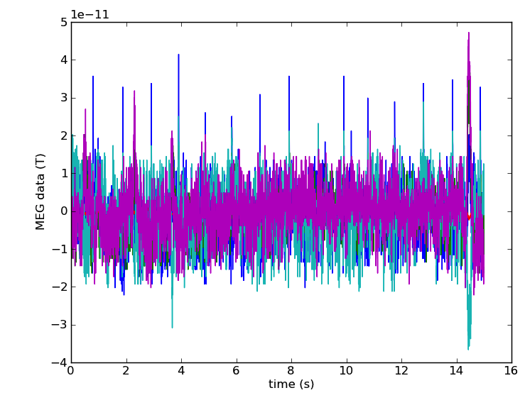
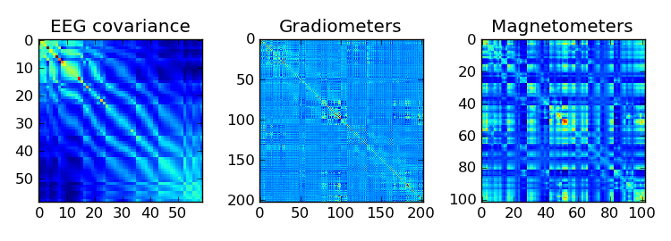
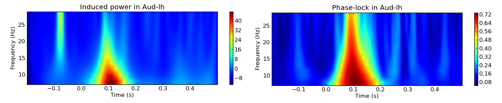

.. raw:: html

   
   MNE-Python: MNE with Python
   
    Alexandre Gramfort, Martin Luessi, Matti S. Hamalainen
   

Aalto University, June 19, 2012

Link to these slides: http://mne-tools.github.com/mne-python-intro-slides

----

Outline:
--------

- Design Principles
- Status
- Feature overview
- Example Usage
- Future Plans

----

.. Why use Python for MEG?
.. -----------------------------------
..
.. - Python is free (as in speech)
.. - It "combines remarkable power with very clear syntax" [1]_
.. - Well suited for high performance numerical computing (NumPy, SciPy, ...)
.. - High quality 2D and 3D visualizations (pylab, mlab, ...)
.. - Increasingly popular in neuroscience (nipy, nipype, nitime, ...)
..
..
.. .. [1] `<http://docs.python.org/faq/general.html#what-is-python/>`_
..
.. ----

MNE-Python Design Principles
----------------------------

- Provide a powerful but easy-to-use scripting interface (no GUI)
- Extend functionality of the MNE command line tools
- Implement all features of the MNE Matlab toolbox
- Simplicity, clean code, and good documentation
- Permissive BSD license (allows use in commercial products)
- Open development `<http://github.com/mne-tools/mne-python>`_
- Do not depend on any commercial software

----

MNE-Python Status
-----------------

- Current version: 0.3 (released March 23, 2012)
- Main contributors: Alexandre Gramfort and Martin Luessi (hopefully more in the future)
- 7870 lines of code, 4530 lines of comments
- 62 unit tests, 81% test coverage
- 33 examples

----

Key Features
------------

Preprocessing
~~~~~~~~~~~~~

- Filtering of raw files
- Detect ECG and EOG events (for SSP)
- Compute SSP projectors
- Extract events from raw files
- Compute noise covariance matrix
- Extract epochs and compute evoked responses

Inverse Solution
~~~~~~~~~~~~~~~~

- Compute MNE/dSPM/sLORETA inverse operator
- Compute inverse solution for evoked, epochs and raw data
- Morph source space data between subjects (using FreeSurfer registration)
- Save source space data as .stc, .w, or .nii.gz (4D NIfTI) file

----

Key Features Cont.
------------------

Time-Frequency Analysis
~~~~~~~~~~~~~~~~~~~~~~~

- Compute multi-taper PSD of raw data
- Compute induced power and phase lock in sensor and source space

Statistics
~~~~~~~~~~

- Permutation F and T tests
- Non-parametric cluster statistics

----

What MNE-Python Can't Do
------------------------

- Forward modeling (use MNE command line tools)
- Raw data visualization (use ``mne_browse_raw``)
- Interactive visualization of source estimates (use ``mne_analyze``) [#f1]_

.. [#f1] Can be done with `PySurfer <http://pysurfer.github.com>`_

.. image:: images/pysurfer.png
   :scale: 40%

----

Reading and Plotting Raw Data
-----------------------------

.. sourcecode:: python

    import pylab as pl
    import mne
    raw = mne.fiff.Raw(fname)

    picks = mne.fiff.pick_types(raw.info, meg='mag')
    some_picks = picks[:5]  # take 5 first
    start, stop = raw.time_to_index(0, 15)  # read the first 15s of data
    data, times = raw[some_picks, start:(stop + 1)]

    pl.plot(times, data.T)
    pl.xlabel('time (s)')
    pl.ylabel('MEG data (T)')

----

Band-pass Filter Raw File
-------------------------

.. sourcecode:: python

    import mne

    fname = 'raw.fif'
    raw = mne.fiff.Raw(fname)

    # keep beta band
    raw.filter(13.0, 30.0, filter_length=4096, n_jobs=8)

    # save the result
    raw.save(fname[:-4] + '_beta.fif')

Notice:
~~~~~~~
- Raw is a class, it provides various functions for filtering etc.
- The filtering is performed in parallel by using ``n_jobs=8``

----

Multi-Tapper PSD of Raw Data
----------------------------

.. sourcecode:: python

    from mne.time_frequency import compute_raw_psd
    raw = mne.fiff.Raw(raw_fname)

    picks = mne.fiff.pick_types(raw.info, meg='grad')  # picks MEG gradiometers

    tmin, tmax = 0, 60  # use the first 60s of data
    fmin, fmax = 0, 300  # look at frequencies between 0 and 300Hz
    NFFT = 2048 # the FFT size (NFFT). Ideally a power of 2
    psds, freqs = compute_raw_psd(raw, tmin=tmin, tmax=tmax, picks=picks,
                                  fmin=fmin, fmax=fmax, NFFT=NFFT, n_jobs=4)

.. image:: images/mt_psd.png
   :scale: 50%

----

Computing Contrasts
-------------------

.. sourcecode:: python

   import mne

   ...

   epochs1 = mne.Epochs(raw, events, event_id1, tmin, tmax, picks=picks,
                        baseline=(None, 0), reject=reject)
   epochs2 = mne.Epochs(raw, events, event_id2, tmin, tmax, picks=picks,
                        baseline=(None, 0), reject=reject)

   evoked1 = epochs1.average()
   evoked2 = epochs2.average()

   contrast = evoked1 - evoked2

- Arithmetic operations are supported for Evoked, SourceEstimate, and Covariance
- The number of averages, degrees of freedom, etc. are used during the calculation
- An exception is raised if the objects are incompatible
  (e.g. different SSP projectors in covariances)

----

Evoked Response and Noise Cov.
------------------------------------

.. sourcecode:: python

    import mne

    fname = 'raw.fif'
    raw = mne.fiff.Raw(fname)
    raw.info['bads'] = ['MEG 2443', 'EEG 053']  # mark bad channels

    # extract epochs
    picks = mne.fiff.pick_types(raw.info, meg=True, eeg=True, eog=True,
                                exclude=raw.info['bads'])
    event_id, tmin, tmax = 1, -0.2, 0.5
    events = mne.find_events(raw, stim_channel='STI 014')
    epochs = mne.Epochs(raw, events, event_id, tmin, tmax, proj=True,
                        picks=picks, baseline=(None, 0), preload=True,
                        reject=dict(grad=4000e-13, mag=4e-12, eog=150e-6))

    # compute evoked response and noise covariance
    evoked = epochs.average()
    cov = mne.compute_covariance(epochs, tmax=0)

    # save them
    evoked.save('event_%d-evoked.fif' % event_id)
    cov.save('event_%d-cov.fif' % event_id)

----

Plot Evoked Response
------------------------

.. sourcecode:: python

   import mne
   from mne.viz import plot_evoked

   evoked = mne.fiff.Evoked('event_1-evoked.fif')

   plot_evoked(evoked)

.. image:: images/plot_evoked.png
      :scale: 70%

----

Visualizing the Noise Covariance
------------------------------------

.. sourcecode:: python

    import mne

    ...

    cov = mne.read_cov('event_1-cov.fif')
    # Show covariance
    mne.viz.plot_cov(cov, raw.info, exclude=raw.info['bads'], colorbar=True,
                     proj=True)  # try setting proj to False to see the effect

----

dSPM Inverse Solution
-------------------------

.. sourcecode:: python

    import mne

    # load data
    evoked = mne.fiff.Evoked('event_1-evoked.fif')
    cov = mne.read_cov('event_1-cov.fif')

    # compute inverse operator
    fwd_fname = 'sample_audvis-meg-eeg-oct-6-fwd.fif'
    fwd = mne.read_forward_solution(fwd_fname, surf_ori=True)
    inv = mne.minimum_norm.make_inverse_operator(raw.info, fwd, cov, loose=0.2)

    # compute inverse solution
    lambda2 = 1 / 3.0 ** 2
    method = 'dSPM'  # use dSPM method (could also be MNE or sLORETA)

    stc = mne.minimum_norm.apply_inverse(evoked, inv, lambda2, method)

    # morph it to average brain
    stc_avg = mne.morph_data('sample', 'fsaverage', stc, 5, smooth=5)

    # save it
    stc_avg.save('event_1_dspm_fsaverage')

----

dSPM Inv. Sol. in Volume Source Space
-----------------------------------------

.. sourcecode:: python

    from mne.minimum_norm import apply_inverse, read_inverse_operator
    
    snr = 3.0
    lambda2 = 1.0 / snr ** 2
    method = 'dSPM'
    
    # Load data
    evoked = mne.fiff.Evoked(fname_evoked, setno=0, baseline=(None, 0))
    inverse_operator = read_inverse_operator(fname_inv)

    # Compute inverse solution
    stc = apply_inverse(evoked, inverse_operator, lambda2, method)
    stc.crop(0.0, 0.2)

    # Save result in a 4D nifti file
    src = inverse_operator['src']
    img = mne.save_stc_as_volume('mne_%s_inverse.nii.gz' % method, stc,
            src, mri_resolution=False)  # set to True for full MRI resolution

----

dSPM Inv. Sol. on Single Epochs
-----------------------------------

.. sourcecode:: python

    import mne
    from mne.minimum_norm import apply_inverse_epochs

    event_id, tmin, tmax = 1, -0.2, 0.5
    snr = 1.0
    lambda2 = 1.0 / snr ** 2
    method = 'dSPM'

    # Load data
    inverse_operator = mne.minimum_norm.read_inverse_operator(fname_inv)
    label = mne.read_label(fname_label)
    raw = mne.fiff.Raw(fname_raw)
    events = mne.read_events(fname_event)

    picks = mne.fiff.pick_types(raw.info, meg=True, eeg=False, stim=False, eog=True)

    epochs = mne.Epochs(raw, events, event_id, tmin, tmax, picks=picks,
                        baseline=(None, 0),
                        reject=dict(mag=4e-12, grad=4000e-13, eog=150e-6))

    # Compute inverse solution and stcs for each epoch
    stcs = apply_inverse_epochs(epochs, inverse_operator,
                                lambda2, method, label, pick_normal=True)

----

Power and Phase Lock in Src. Space
------------------------------------

.. sourcecode:: python

    import mne
    from mne.minimum_norm import read_inverse_operator, source_induced_power

    tmin, tmax, event_id = -0.2, 0.5, 1

    ...  # read raw etc.

    epochs = mne.Epochs(raw, events, event_id, tmin, tmax, picks=picks,
                baseline=(None, 0), reject=dict(grad=4000e-13, eog=150e-6),
                preload=True)

    # Compute a source estimate per frequency band
    freqs = np.arange(7, 30, 2)  # define frequencies of interest
    label = mne.read_label(fname_label)
    power, phase_lock = source_induced_power(epochs, inverse_operator, freqs,
                label, baseline=(-0.1, 0), baseline_mode='percent', n_cycles=2)

----

Computing SSPs for ECG and EOG
--------------------------------------------------

First compute ECG projections with:

.. sourcecode:: bash

   $mne_compute_proj_ecg.py -i protocol_run1_raw.fif --l-freq 1 --h-freq 100 \
   --rej-grad 3000 --rej-mag 4000 --rej-eeg 100 --average -c "ECG063" \
   --ecg-h-freq 25 --tstart 5

Detects heartbeats using the channel ECG063 & computes the projections on data filtered between 1 and 100Hz & saves 2 files:
The events in (you should look at them in mne_browse_raw)

*protocol_run1_raw_ecg-eve.fif*

and the file containing the projections (look at their effect with mne_browse_raw)

*protocol_run1_raw_ecg_avg_proj.fif*

For general help on the command:

.. sourcecode:: bash

    $mne_compute_proj_ecg.py -h

For EOG now:

.. sourcecode:: bash

    $mne_compute_proj_eog.py -i protocol_run1_raw.fif --l-freq 1 --h-freq 35 \
    --rej-grad 3000 --rej-mag 4000 --rej-eeg 100 \
    --proj protocol_run1_raw_ecg_avg_proj.fif –average

This will save *protocol_run1_raw_eog-eve.fif* containing the events and
*protocol_run1_raw_eog_avg_proj.fif* containing the SSP projections.

----

Future Plans
------------

- Beamformers
- Mixed-norm source estimates
- Noise covariance computation with automatic regularization
- Coherence computation in sensor and source space (multi-taper method from nitime)
- Network- and connectivity analysis
- **Whatever you want to contribute**

----

Some links
----------

Doc:

- http://martinos.org/mne/ (general doc)
- http://martinos.org/mne/python_tutorial.html (python tutorial)
- http://martinos.org/mne/auto_examples/index.html (python examples)

Code:

- https://github.com/mne-tools/mne-python (mne-python code)
- https://github.com/mne-tools/mne-scripts (mne shell scripts)
- https://github.com/mne-tools/mne-matlab (mne matlab toolbox)
