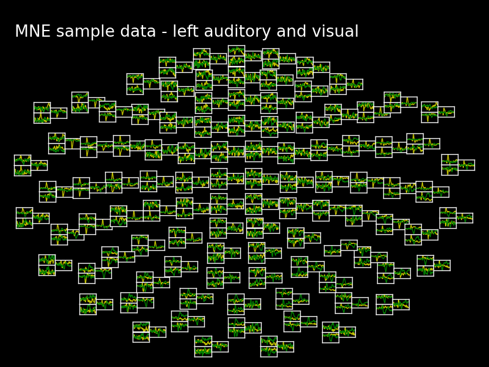

.. raw:: html

   
   MNE-Python: MNE with Python

MNE website: http://martinos.org/mne

Link to these slides: http://mne-tools.github.com/mne-python-intro-slides

----

Outline:
--------

- Why Python?
- Design Principles
- Status
- Feature Overview
- Example Usage

----

Why use Python for MEG?
-----------------------------------

- Python is an **intepreted high-level programming language**
- Python is **free** (as in speech)
- It "combines **remarkable power** with **very clear syntax**" [1]_
- Well suited for **high performance numerical computing** (NumPy, SciPy, ...)
- High quality **2D and 3D visualization** (pylab, mlab, ...)
- Increasingly **popular in neuroscience** (nipy, nipype, nitime, ...)

.. [1] `<http://docs.python.org/faq/general.html#what-is-python/>`_

----

MNE-Python Design Principles
----------------------------

- Provide a powerful but easy-to-use scripting interface (no GUI)
- Extend functionality of the MNE command line tools
- Implement all features of the MNE Matlab toolbox
- Simplicity, clean code, and good documentation
- Computationally efficient implementation, use parallel processing
- Permissive BSD license (allows use in commercial products)
- Open development `<http://github.com/mne-tools/mne-python>`_
- Do not depend on any commercial software

----

MNE-Python Status
-----------------

- Current version: 0.5 (released December 26, 2012)
- 23492 lines of code, 12533 lines of comments
- 141 unit tests, 82% test coverage
- 62 examples

----

Main Contributors
-----------------

- Alexandre Gramfort (Telecom ParisTech, CEA/Neurospin, France)
- Eric Larson (University of Washington, United States)
- Martin Luessi (MGH Martinos Center, United States)
- Denis Engemann (Juelich Research Centre, Germany)
- Christian Brodbeck (New York University, United States)
- Daniel Strohmeier (Technical University Ilmenau, Germany)
- Matti Hamalainen (MGH Martinos Center, United States)
- **you**?

----

Key Features
------------

Preprocessing
~~~~~~~~~~~~~

- Filtering of raw files
- Detect ECG and EOG events (for SSP)
- Compute SSP projectors
- Extract events from raw files
- Compute noise covariance matrix
- Extract epochs and compute evoked responses
- **New in 0.5**: images plotting functions to reveal cross-trial dynamics
- **New in 0.5**: Artifact removal and feature selection using ICA
- **New in 0.5**: Export data (raw, epochs, evoked) to nitime and pandas

----

Key Features Cont.
------------------

Inverse Solution
~~~~~~~~~~~~~~~~

- Compute MNE/dSPM/sLORETA inverse operators
- Compute inverse solution for evoked, epochs and raw data
- Compute Linearly-Constrained Minimum Variance (LCMV) beamformer solution
- Efficient computation of mixed norm (MxNE) inverse solution
- Morph source space data between subjects (using FreeSurfer registration)
- Save source space data as .stc, .w, or .nii.gz (4D NIfTI) file
- **New in 0.5**: Read and visualize dipole fit (.dip) files
- **New in 0.5**: visualization of source estimates

----

Key Features Cont.
------------------

Time-Frequency Analysis
~~~~~~~~~~~~~~~~~~~~~~~

- Compute power spectral density (PSD) in sensor and source space
- Compute induced power and phase lock in sensor and source space
- **New in 0.5**: Spectrum estimation using multi-taper method
- **New in 0.5**: Sensor topography plot for time-frequency images.

Statistics
~~~~~~~~~~

- F test, permutation T test
- Non-parametric cluster statistics

----

**New in 0.5**: Connectivity Estimation
~~~~~~~~~~~~~~~~~~~~~~~~~~~~~~~~~~~~~~~

- Sensor space and source space
- Flexible configuration of seed-based or all-to-all connectivity
- Supported measures: Coherence, Imag. Coherence, PLV, PLI, WPLI, ...
- Computationally efficient

----

**New in 0.5**: ICA
~~~~~~~~~~~~~~~~~~~

- Decompose raw and epochs MEG and EEG data
- Extract and visualize sources
- Automatically identify sources using scipy distance metrics, correlation
  or custom functions
- Export sources to raw object to apply mne-python sensor-space techniques
  in ICA space or to browse sources using ``mne_brows_raw``
- Efficient: decompose once, then save the ICA to later update the selection
- Flexible: Undo PCA dimensionality reduction to the extend desired after ICA. 
  On back-transforming to sensor-space you can choose how many removed PCA
  components to add back. 

----

**New in 0.5**: Embedded exporters
~~~~~~~~~~~~~~~~~~~~~~~~~~~~~~~~~~

- use ``.as_data_frame`` method to export raw, epochs and evoked data to
  the Pandas data analysis library
- use ``.to_nitime`` method to export raw, epochs and evoked data to
  the NiTime time series library

----

What MNE-Python Can't Do
------------------------

- Forward modeling (use MNE command line tools)
- Raw data visualization (use ``mne_browse_raw``)

----

Reading and Plotting Raw Data
-----------------------------

.. sourcecode:: python

    import pylab as pl
    import mne
    raw = mne.fiff.Raw(fname)

    picks = mne.fiff.pick_types(raw.info, meg='mag')
    start, stop = raw.time_as_index([0, 15])  # read the first 15s of data
    data, times = raw[picks[:5], start:(stop + 1)]  # take 5 first channels

    pl.plot(times, data.T)
    pl.xlabel('time (s)')
    pl.ylabel('MEG data (T)')

.. image:: images/raw_data.png
   :scale: 45%

----

Band-pass Filter Raw File
-------------------------

.. sourcecode:: python

    import mne

    fname = 'raw.fif'
    raw = mne.fiff.Raw(fname)

    # keep beta band
    raw.filter(13.0, 30.0, filter_length=4096, n_jobs=8)

    # save the result
    raw.save(fname[:-4] + '_beta.fif')

Notice:
~~~~~~~
- Raw is a class, it provides various functions for filtering etc.
- The filtering is performed in parallel by using ``n_jobs=8``

----

PSD of Raw Data
----------------------------

.. sourcecode:: python

    from mne.time_frequency import compute_raw_psd

    raw = mne.fiff.Raw(raw_fname)
    picks = mne.fiff.pick_types(raw.info, meg='grad')  # picks MEG gradiometers
    tmin, tmax = 0, 60  # use the first 60s of data
    fmin, fmax = 0, 300  # look at frequencies between 0 and 300Hz
    NFFT = 2048 # the FFT size (NFFT). Ideally a power of 2
    psds, freqs = compute_raw_psd(raw, tmin=tmin, tmax=tmax, picks=picks,
                                  fmin=fmin, fmax=fmax, NFFT=NFFT, n_jobs=4)

.. image:: images/mt_psd.png
   :scale: 50%

----

Evoked Response and Noise Cov.
------------------------------------

.. sourcecode:: python

    import mne

    fname = 'raw.fif'
    raw = mne.fiff.Raw(fname)
    raw.info['bads'] = ['MEG 2443', 'EEG 053']  # mark bad channels

    # extract epochs
    picks = mne.fiff.pick_types(raw.info, meg=True, eeg=True, eog=True,
                                exclude=raw.info['bads'])
    event_id, tmin, tmax = 1, -0.2, 0.5
    events = mne.find_events(raw, stim_channel='STI 014')
    epochs = mne.Epochs(raw, events, event_id, tmin, tmax, proj=True,
                        picks=picks, baseline=(None, 0), preload=True,
                        reject=dict(grad=4000e-13, mag=4e-12, eog=150e-6))

    # compute evoked response and noise covariance
    evoked = epochs.average()
    cov = mne.compute_covariance(epochs, tmax=0)
    # save them
    epochs.save('event_%d-epo.fif' % event_id)
    evoked.save('event_%d-ave.fif' % event_id)
    cov.save('event_%d-cov.fif' % event_id)

----

Computing Contrasts
-------------------

.. sourcecode:: python

    import mne

    ...

    epochs1 = mne.Epochs(raw, events, event_id1, tmin, tmax, picks=picks,
                        baseline=(None, 0), reject=reject)
    epochs2 = mne.Epochs(raw, events, event_id2, tmin, tmax, picks=picks,
                       baseline=(None, 0), reject=reject)

    evoked1 = epochs1.average()
    evoked2 = epochs2.average()

    contrast = evoked1 - evoked2

- Arithmetic operations are supported for Evoked, SourceEstimate, and Covariance
- The number of averages, degrees of freedom, etc. are used during the calculation
- An exception is raised if the objects are incompatible
  (e.g. different SSP projectors in covariances)

----

Plot Evoked Response
--------------------

.. sourcecode:: python

   import mne

   evoked = mne.fiff.Evoked('event_1-ave.fif')

   evoked.plot()

.. image:: images/plot_evoked.png
      :scale: 70%

----

Handle Conditions Using Epochs
------------------------------

.. sourcecode:: python
	
   import mne
   
   ... # read raw data, set title, read layout
       
   epochs = mne.Epochs(raw, events, dict(aud_l=1, vis_l=3), tmin, tmax,
                       picks=picks, baseline=(None, 0), reject=reject)
   					
   evokeds = [epochs[cond].average() for cond in 'aud_l', 'vis_r']
   
   mne.viz.plot_topo(evokeds, layout, color=['y', 'g'], title=title)

	
----

Automatically Find Artifacts Using ICA
--------------------------------------

.. sourcecode:: python
   
   import mne
   
   ...
   
   ica = ICA(n_components=0.90, max_pca_components=100)
   
   ica.decompose_raw(raw, start=start, stop=stop, picks=picks)
       
   # identify ECG component and generate sort-index
   ecg_scores = ica.find_sources_raw(raw, target='MEG 1531',
                                     score_func='pearsonr')
   
   start_plot, stop_plot = raw.time_as_index([100, 103])
   order = np.abs(ecg_scores).argsort()[::-1]
   ica.plot_sources_raw(raw, order=order, start=start_plot, stop=stop_plot)
  
   # remove 1 component and transform to sensor space 
   raw_cleaned = ica.pick_sources_raw(raw,
                     exclude=[np.abs(ecg_scroes).argmax()])

   ica_raw = ica.sources_as_raw(raw)  # ICA-space raw data object    
   ica.save('my_ica.fif')  # restore: mne.preprocessing.read_ica('my_ica.fif')
   
	
----

Visualizing the Noise Covariance
------------------------------------

.. sourcecode:: python

    import mne

    ...

    cov = mne.read_cov('event_1-cov.fif')
    # Show covariance
    mne.viz.plot_cov(cov, raw.info, exclude=raw.info['bads'], colorbar=True,
                     proj=True)  # try setting proj to False to see the effect

.. image:: images/plot_cov.png
    :scale: 100%

----

dSPM Inverse Solution
-------------------------

.. sourcecode:: python

    import mne

    # load data
    evoked = mne.fiff.Evoked('event_1-ave.fif')
    cov = mne.read_cov('event_1-cov.fif')

    # compute inverse operator
    fwd_fname = 'sample_audvis-meg-eeg-oct-6-fwd.fif'
    fwd = mne.read_forward_solution(fwd_fname, surf_ori=True)
    inv = mne.minimum_norm.make_inverse_operator(raw.info, fwd, cov, loose=0.2)

    # compute inverse solution
    lambda2 = 1 / 3.0 ** 2
    method = 'dSPM'  # use dSPM method (could also be MNE or sLORETA)

    stc = mne.minimum_norm.apply_inverse(evoked, inv, lambda2, method)

    # morph it to average brain
    stc_avg = mne.morph_data('sample', 'fsaverage', stc, 5, smooth=5)

    # save it
    stc_avg.save('event_1_dspm_fsaverage')

----

dSPM Inv. Sol. in Volume Source Space
-----------------------------------------

.. sourcecode:: python

    from mne.minimum_norm import apply_inverse, read_inverse_operator

    snr = 3.0
    lambda2 = 1.0 / snr ** 2
    method = 'dSPM'

    # Load data
    evoked = mne.fiff.Evoked(fname_evoked, setno=0, baseline=(None, 0))
    inverse_operator = read_inverse_operator(fname_inv)

    # Compute inverse solution
    stc = apply_inverse(evoked, inverse_operator, lambda2, method)
    stc.crop(0.0, 0.2)

    # Save result in a 4D nifti file
    src = inverse_operator['src']
    img = mne.save_stc_as_volume('mne_%s_inverse.nii.gz' % method, stc,
          src, mri_resolution=False)  # set to True for full MRI resolution

----

dSPM Inv. Sol. on Single Epochs
-----------------------------------

.. sourcecode:: python

    import mne
    from mne.minimum_norm import apply_inverse_epochs

    event_id, tmin, tmax = 1, -0.2, 0.5
    snr = 1.0
    lambda2 = 1.0 / snr ** 2

    # Load data
    inverse_operator = mne.minimum_norm.read_inverse_operator(fname_inv)
    label = mne.read_label(fname_label)
    raw = mne.fiff.Raw(fname_raw)
    events = mne.read_events(fname_event)
    picks = mne.fiff.pick_types(raw.info, meg=True, eeg=False, stim=False,
                                eog=True)

    epochs = mne.Epochs(raw, events, event_id, tmin, tmax, picks=picks,
                        baseline=(None, 0),
                        reject=dict(mag=4e-12, grad=4000e-13, eog=150e-6))

    # Compute inverse solution and stcs for each epoch
    stcs = apply_inverse_epochs(epochs, inverse_operator, lambda2, 'dSPM',
                                label, pick_normal=True, return_generator=True)

----

LCMV Beamformer Solution
------------------------

.. sourcecode:: python

    import mne
    from mne.beamformer import lcmv

    ... # read raw etc.

    # Use only left-temporal channels
    left_temporal_channels = mne.read_selection('Left-temporal')
    picks = pick_types(raw.info, meg=True, eeg=False, stim=True, eog=True,
               exclude=raw.info['bads'], selection=left_temporal_channels)

    # Compute evoked response, noise- and data covariance matrices
    epochs = mne.Epochs(raw, events, event_id, tmin, tmax, proj=True,
                        picks=picks, baseline=(None, 0), preload=True,
                        reject=dict(grad=4000e-13, mag=4e-12, eog=150e-6))
    evoked = epochs.average()

    forward = mne.read_forward_solution(fname_fwd)
    noise_cov = mne.cov.regularize(mne.read_cov(fname_cov), evoked.info,
                                   mag=0.05, grad=0.05, eeg=0.1, proj=True)
    data_cov = mne.compute_covariance(epochs, tmin=0.04, tmax=0.15)

    stc = lcmv(evoked, forward, noise_cov, data_cov, reg=0.01)

----

Mixed norm (MxNE) Inverse Solution
----------------------------------

.. sourcecode:: python

    from mne.mixed_norm import mixed_norm
    from mne.minimum_norm import make_inverse_operator, apply_inverse
    # Read what's necessary ...
    alpha = 70  # regularization parameter between 0 and 100 (100 is high)
    loose, depth = 0.2, 0.9  # loose orientation & depth weighting
    # First compute dSPM solution to be used as weights in MxNE, then MxNE
    inverse_operator = make_inverse_operator(evoked.info, forward, cov,
                                             loose=loose, depth=depth)
    stc_dspm = apply_inverse(evoked, inverse_operator, lambda2=1. / 9.,
                             method='dSPM')
    stc = mixed_norm(evoked, forward, cov, alpha, loose=loose,
                     depth=depth, maxit=3000, tol=1e-4, active_set_size=10,
                     debias=True, weights=stc_dspm, weights_min=8.)

.. image:: images/mxne.png
   :scale: 40%

----

Power and Phase Lock in Src. Space
------------------------------------

.. sourcecode:: python

    import mne
    from mne.minimum_norm import read_inverse_operator, source_induced_power

    ...  # read raw, set event_id, tmin and tmax

    epochs = mne.Epochs(raw, events, event_id, tmin, tmax, picks=picks,
                baseline=(None, 0), reject=dict(grad=4000e-13, eog=150e-6),
                preload=True)

    # Compute a source estimate per frequency band
    freqs = np.arange(7, 30, 2)  # define frequencies of interest
    label = mne.read_label(fname_label)
    power, phase_lock = source_induced_power(epochs, inverse_operator, freqs,
                label, baseline=(-0.1, 0), baseline_mode='percent', n_cycles=2)

.. image:: images/phase_lock.png
   :scale: 60%

----

Time-Frequency Connectivity Estimation
--------------------------------------

.. sourcecode:: python

    import mne
    from mne.connectivity import spectral_connectivity

    ...  # read raw, Create epochs for left-visual condition
    epochs = mne.Epochs(raw, events, event_id, tmin, tmax, picks=picks,
                    baseline=(None, 0), reject=dict(grad=4000e-13, eog=150e-6))
    # Compute connectivity
    indices = seed_target_indices(epochs.ch_names.index('MEG 2343'),
                                  np.arange(len(epochs.ch_names)))
    con, freqs, times, _, _ = spectral_connectivity(epochs, indices=indices,
        method='wpli2_debiased', mode='cwt_morlet', sfreq=raw.info['sfreq'],
        cwt_frequencies=np.arange(7, 30, 2), n_jobs=4)

----

Computing SSPs for ECG and EOG
--------------------------------------------------

First compute ECG projections with:

.. sourcecode:: bash

    $mne_compute_proj_ecg.py -i protocol_run1_raw.fif --l-freq 1 --h-freq 100 \
    --rej-grad 3000 --rej-mag 4000 --rej-eeg 100 --average -c "ECG063" \
    --ecg-h-freq 25 --tstart 5

Detects heartbeats using the channel ECG063 & computes the projections on data filtered between 1 and 100Hz & saves 2 files:
The events in (you should look at them in mne_browse_raw)

*protocol_run1_raw_ecg-eve.fif*

and the file containing the projections (look at their effect with mne_browse_raw)

*protocol_run1_raw_ecg_avg_proj.fif*

For general help on the command:

.. sourcecode:: bash

    $mne_compute_proj_ecg.py -h

For EOG now:

.. sourcecode:: bash

    $mne_compute_proj_eog.py -i protocol_run1_raw.fif --l-freq 1 --h-freq 35 \
    --rej-grad 3000 --rej-mag 4000 --rej-eeg 100 \
    --proj protocol_run1_raw_ecg_avg_proj.fif –average

This will save *protocol_run1_raw_eog-eve.fif* containing the events and
*protocol_run1_raw_eog_avg_proj.fif* containing the SSP projections.

----

Some links
----------

Documentation:

- http://martinos.org/mne/ (general doc)
- http://martinos.org/mne/python_tutorial.html (python tutorial)
- http://martinos.org/mne/auto_examples/index.html (python examples)

Code:

- https://github.com/mne-tools/mne-python (mne-python code)
- https://github.com/mne-tools/mne-matlab (mne matlab toolbox)
- https://github.com/mne-tools/mne-scripts (mne shell scripts)
